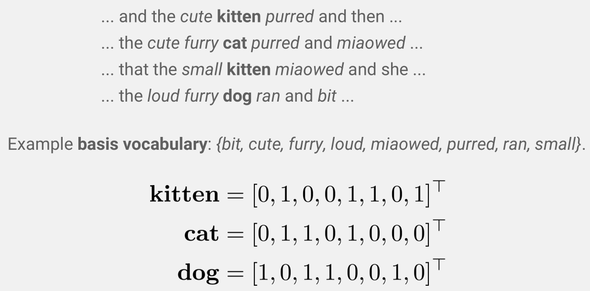
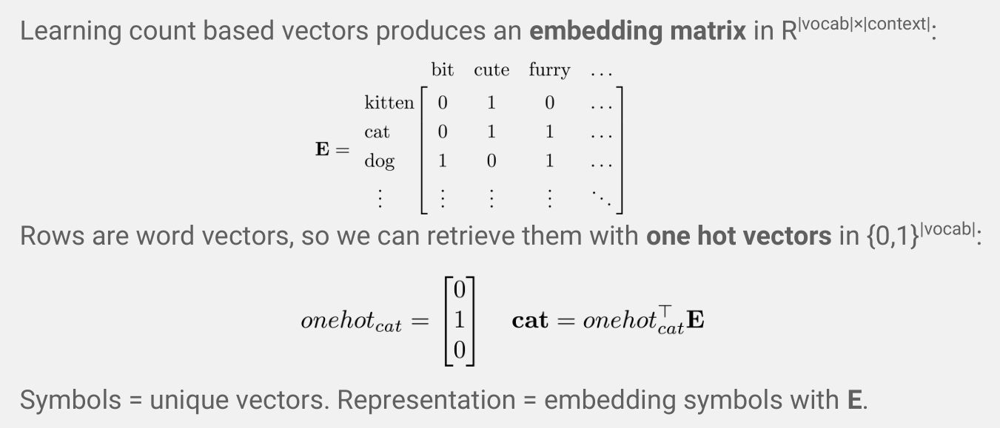
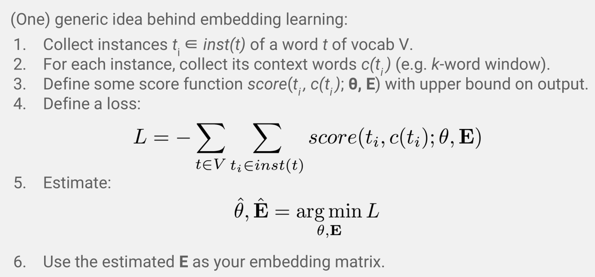
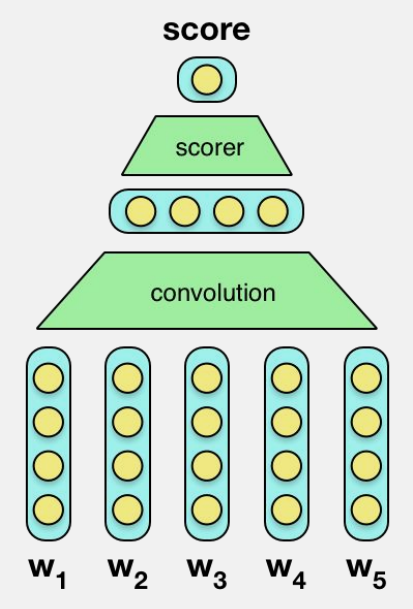
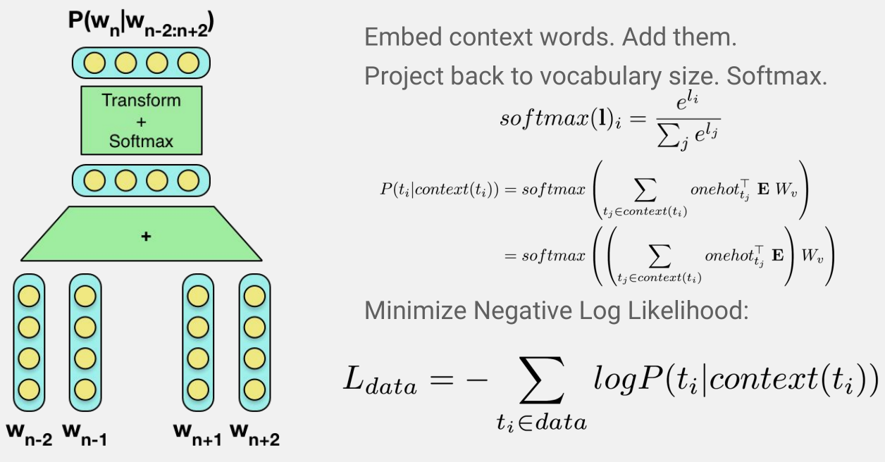
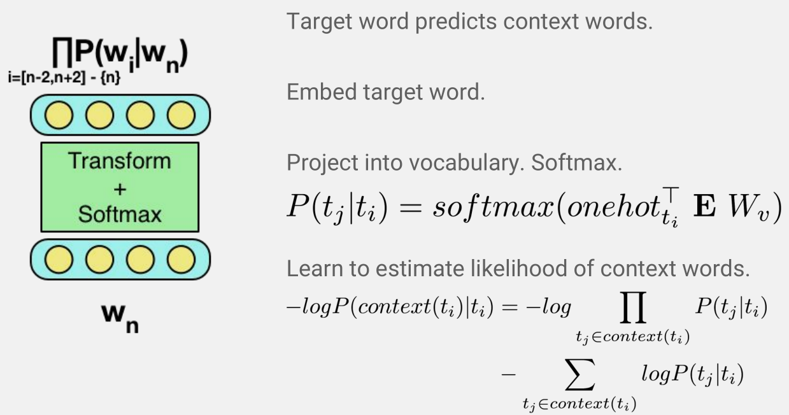

#Oxford Deep NLP学习笔记1：Word Level Semantics 

本节课是Oxford Deep NLP 2017 course的第一课，由Ed Grefenstette讲解。

Slides：https://github.com/oxford-cs-deepnlp-2017/lectures

Videos：https://www.bilibili.com/video/av9817911/?from=search&seid=2691326368420649676

Prerequisite: Probability, Linear Algebra, and Continuous Mathematics, basic Machine Learning and Neural Networks. 

本人是自然语言处理小白一枚，由于没有中文翻译字幕，因此若有不当的翻译和理解，还望指正。

##1.1 One-hot representation

自然语言文本 = 离散符号的序列，我们目前考虑最小单位为词。

最朴素的编码方式：one-hot representation，即某个词出现则对应位置标记为1，其余位置标记为0；向量的维数为词表大小，因此可能非常巨大；在经典的信息检索（IR）中，文档（document）和查询（query）都以这种方式编码为向量，在向量空间（vector space）计算它们的相似度（如余弦度量），$\hat {d_q} = \underset{d}{\operatorname{argmax}} sim(d, q)$；

存在的问题：维数灾难和稀疏（sparse）会导致计算上的问题；将每个词独立对待忽略了词与词之间的语义关联（orthogonal representation、semantically weak）

##1.2 Distributed Representation

> "You shall know a word by the company it keeps." -----J.R.Firth

我们希望更丰富地表示词与词之间的语义相似程度，引入Distributional semantics，即基于上下文（context/use）的稠密向量（dense vector）表示法。产生稠密词向量的三种主要手段：

- count-based：对文本中词出现的频次做计数
- predictive：通过上下文预测中心词，或通过中心词预测上下文
- task-based：任务驱动，"word representations are learned based on how well they help perform a particular task."

下面具体介绍这三种手段。

###1.2.1 Count-based methods

定义一个基本的词汇表C和一个窗口大小w（超参数）。

对于要编码的词，观察其左右两侧共w个词，统计属于词汇表C里的词的频次，组成一个向量。相当于用C中的词作为目标词的特征。

例：（粗体为要编码的目标词）

得到每个词的向量后，就可以用余弦值计算词与词之间的相似度。(附$cosine(u, v) = \frac {uv} {|u| |v|}$)

存在的问题：实际上C中的某些词可能在所有目标词的窗口里出现次数都很多，所以它们并不能准确描述两个目标词的异同，因此在信息检索中常用TF-IDF、PMI等规范化方法（normalization method）。

### 1.2.2 Neural Embedding Models

用神经网络去训练词嵌入模型，得到词向量。

关于word embedding的理解，可以先参考知乎上的这个回答[有谁可以解释下word embedding? - 回答作者: 寒蝉鸣泣](https://zhihu.com/question/32275069/answer/80188672)

**词嵌入矩阵$E$（word embedding matrix）**：每一行都代表目标词的词向量，每一列都代表基本词汇表C中的词在各个目标词的上下文中出现的频次。要取出某个词的词向量时，只需用它的one-hot向量的转置乘以矩阵E。

学习的目标是通过调整参数θ和*$E$*，使得定义的score函数值最高：

得分函数的定义非常关键，理想情况下，需要满足：

- 必须要用到词嵌入矩阵$E$来嵌入词$t_i$
- 产生一个数值，能反映$t_i$被上下文$c(t_i)$释义，或上下文$c(t_i)被$$t_i$释义的程度
- 某个词能比其他随机的词，更好地解释其所在的上下文 (Requires the word to account for the context (or the reverse) more than another word in the same place)
- 产生可微分的损失(differentiable loss)，用于神经网络中的梯度下降和反向传播

####1.2.2.1 C&W

> 推荐阅读：
>
> Deep Learning in NLP （一）词向量和语言模型 http://licstar.net/archives/328#s22

以句子作为一个词的上下文，为句子中的每个词做词嵌入。

过程如下：首先随机初始化词嵌入矩阵，用句中每个词的one-hot向量提取出初始的词向量w1,w2...wn；所有向量先通过浅层卷积（shallow convolution，最简单的就是每个向量的对应维度直接相加），再经由估分函数（scorer，一个MLP多层感知机）映射为一个*标量分值*。其中shallow convolution和scorer的参数集合为$\theta$。整个网络为句子s建模了一个函数$g_{\theta,E} (s)= f_{\theta}(embed_E(s))$.

如何防止网络忽略输入而输出高得分？在实际训练中，对每个句子s，我们随机污染其中的一些词，来抽样出一个干扰句子z（distractor sentence，例如a *cat* slept的干扰句子可以是a *car* slept），并使用[hinge loss](https://en.wikipedia.org/wiki/Hinge_loss)定义损失函数$L = max(0, \ 1-(g_{\theta,E}(s) - g_{\theta,E}(z) ))$，目的是为了让函数能很好地感知输入，产生合理的分值。 

对该模型的直观解释：（Representations carry information about what neighboring representations should look like.）一个词的向量表示，蕴含的信息是它所在上下文的词应当是什么样的，或者说这个词的编码表达着其所属类别的信息。如果一个词和附近词在词义上所属的类别和意义接近，那么它们计算的得分应当高，否则得分应当低。

因此，该模型利用了上下文的特性，但其计算复杂度很高。

#### 1.2.2.2 Word2Vec之CBoW

> 推荐阅读：
>
> DL4NLP——词表示模型（二）基于神经网络的模型：NPLM；word2vec（CBOW/Skip-gram）
>
> http://www.cnblogs.com/Determined22/p/5804455.html

CBoW: continuous-bag-of-words（连续词袋模型，不考虑词序的信息），通过上下文来预测中心词。

输入是上下文中的词从嵌入矩阵$E$中提取的词向量，将它们求和（称为投影层，projection），然后直接通过连接到输出层做softmax，输出层的维度为词汇表Vocabulary的大小，每一维代表中某个$w_i$作为中心词的概率。（以负对数似然作为损失函数）

【实际输出维度 >> 图中画的维度】

CBoW模型中没有隐藏层，且涉及的都是线性变换，所以运算起来比较快。但抛弃了词序信息，离中心词近的词可能提供更多信息，后来有改进的论文引入了position-specific matrix。

####1.2.2.3 Word2Vec之Skip-gram

> 辅助理解：一文详解 Word2vec 之 Skip-Gram 模型（结构篇） | 雷锋网
>
> https://www.leiphone.com/news/201706/PamWKpfRFEI42McI.html

Skip-gram：用目标词（中心词）预测上下文中的词。

过程：输入是中心词$w_n$从$E$中提取的词向量，直接连接到输出层做softmax，输出层的维度为Vocabulary的大小，每一维代表某个词$w_i$作为该中心词上下文（同时出现）的概率。

Skip-gram模型由于涉及的参数少，因此计算速度同样非常快，相似的改进有position-specific projections等，在计算效率和结构化程度上平衡。

####1.2.2.4 小结 

> Count based and objective-based models: same general idea.
>
> "Count based and most neural models have **equivalent performance** when properly hyperoptimized(对所有超参数做优化，grid-search或brute force)."

基于神经网络的词向量训练方法，具有易于上手学习（现成的线性代数、反向传播计算工具如keras、tensorflow）、可高度并行计算（mini-batch、GPUs、distributed models）等优势。

### 1.2.3 Evaluating Word Representations

Intrinsic Evaluation（内部评测）: 

WordSim-353, SimLex-999, Word analogy task, Embedding visualization等。不仅要评测pair-wise的相似度，还考虑词向量用于推理（reasoning）的实际效果，如vec("man") - vec("king") + vec("woman") = vec("queen")。

Extrinsic Evaluation（外部评测）：

评估训练出的词向量在其它任务上的效果，即其通用性。

### 1.2.4 Task-based Embedding Learning

多数时候，我们并不是为了单独训练词向量，而是希望从词嵌入矩阵$E$中获取特征作为一个神经网络的输入。因此我们可以直接**<u>将该神经网络的参数和词向量一起训练</u>**。

<u>General Intuition: learn to classify/predict/generate based on features, but also the features themselves.</u>

不仅要让模型学习用给定输入特征做分类、预测、生成任务，而且同时为了优化任务上的效果调整特征本身。

举个例子，如果我们要完成一个NLP任务，如果全部输入特征都随机初始化，那么在数据量较小的情况下效果可能不够好，但是我们可以利用[Fine-tuning](https://en.wikipedia.org/wiki/Fine-tuning)的思想，先利用一个训练好的词嵌入矩阵$E$来作为本任务中的$E$，提取我们需要的特征，然后以较小的学习率训练我们的模型，反向传播优化时，对迁移过来的$E$也做微调，来进一步优化模型的效果。（虽然从零开始训练$E$也没有问题，但是用预训练好的embeddings可能会高效省事:smile:

#### 1.2.4.1 Task-base Features: BoW Classifier

假设我们手头的任务是对句子或者文本分类，如Sentiment Analysis（对一条推文判断其情感极性），Document classification（分析一篇电影评论对应的星级）、Author Identification等等。

最简单的方法：bag of word vectors，忽略词序对句子或文本里的所有词做嵌入。

网络结构可以是简单的线性变换+softmax，得到这段文本所属类别的概率分布。用公式描述就是$P(C|D) = softmax\big (W_c \underset{t_i \in D}{\operatorname{\sum}} embed_E(t_i) \big)$. 当然也可以把网络搭的更深，加上非线性激活的隐藏层，用公式描述就是$P(C|D) = softmax \Big( W_c \sigma \big( \underset{t_i \in D}{\operatorname{\sum}} embed_E(t_i) \big) \Big)$.

这样的结构是容易实现和训练的。在这种情况下，word meaning是由任务驱动(grounded in the task，这个说法好地道，任务赋予了这个词应该是什么意思)，比如推文的情感分析中可以理解为这个词是不是带有一定的正或负向情感。

然而由于忽视了词的上下文关联（词义模糊ambiguity，歧义polysemy等问题），就不能很好地捕捉到一些词的突出性（saliency），导致了文本中的词越多，噪音也就越多。

注意，<u>基于任务的词嵌入利用是**浅层语义**(shallow semantics)</u>，比如"good"这个词除了表达情感以外、"CPU"这个词除了辅助识别类别"Computers"以外都还有更多的语义。

#### 1.2.4.2 Task-base Features:  Bilingual Features

思想：用双语语料训练可以产生更好的词向量。由Hemann和Blunson在2014年提出。

对于文本D里的每个英语（要嵌入的语言）句子，我们都给出其德语的翻译，得到新数据集$D={(e_i, g_i)}_{i \in |D|}$。产生词向量来尽可能最大化每对句子($e_i, g_i$)的相似度，以此产生英语和德语的词各自的嵌入矩阵$E_e, E_g$.

如何用词语的向量组成句子的向量？基于RNN的实践已经取得很好地效果，但在论文中提到的可以是简单的组合函数。句子既可以是bag of words直接相加，也可以引入非线性tanh来考虑一下词序如$e_i = \underset{t_j \in e_i}{\operatorname{\sum}} tanh(t_j+t_{j+1})$.

显然，损失函数就是$L=\underset{(e_i, g_i) \in D}{\operatorname{\sum}}||e_i-g_i||^2$，但是这种损失函数可能会带来退化情况（Degenerate solution），那么得到的结果可能是$E_e = E_g = 0^{|vocabSize|*|embeddingSize|}$，也就是所有向量的所有维度都是0，此时的损失函数当然最小但是完全没有意义。

为了防止退化，再次引入噪声，称为noise-contrastive margin-bases loss，修改损失函数为hinge loss即$L=\underset{(e_i, g_i) \in D}{\operatorname{\sum}}max(-m, ||e_i-g_i||^2-||e_i-g_j||^2), g_i \not=g_j $。对于每对句子($e_i, g_i$)，取样出文本中不同于$g_i$的德语句子$g_j$作为干扰器(disractor)，来使这对匹配句子和这对不匹配句子之间的marin similarity至少大于m。直观理解，就是**确保两个句子的语义对其是发生在高层的理解上的。**

之后的课程中会集中讨论如何解决语义模糊和更好地使用词嵌入。

#### 1.2.4.3 Task-base Features:  Interpretation

基于任务的词嵌入捕捉了词义信息中和任务非常相关的部分，但不能保证捕捉到了除该任务外的通用意义，但可以通过多任务目标（Multi-task objective）来解决这个难题。

##1.3 Final Words

利用训练好的词向量来执行新的任务称为**迁移学习（transfer learning）**。如果在训练数据不足、覆盖的词汇太少的情况下，迁移学习往往能促进手头模型的效果；如果训练数据足够，也可以直接训练，但得到的词向量的重用性（reusability）可能较差。

本节课结语的两句话如下：

- Inputs to neural networks over text are embeddings
- We can train them separately, within a particular task, or both.

