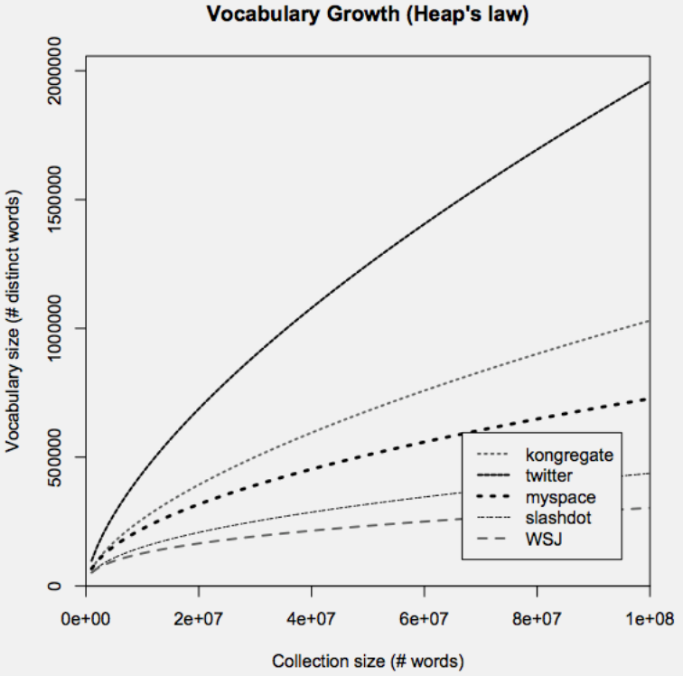
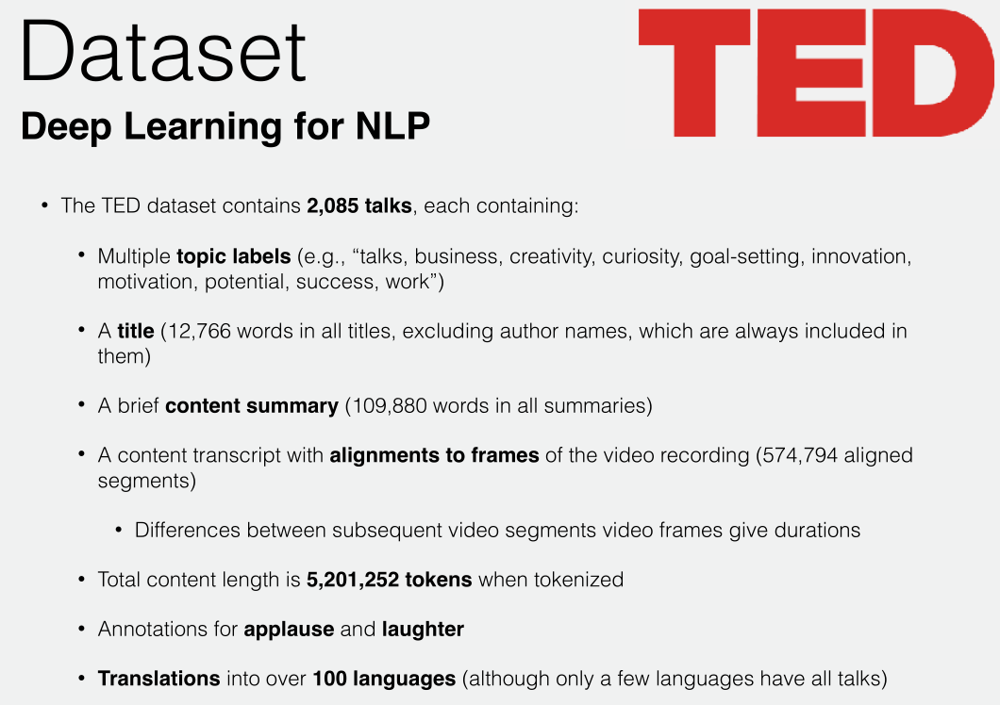
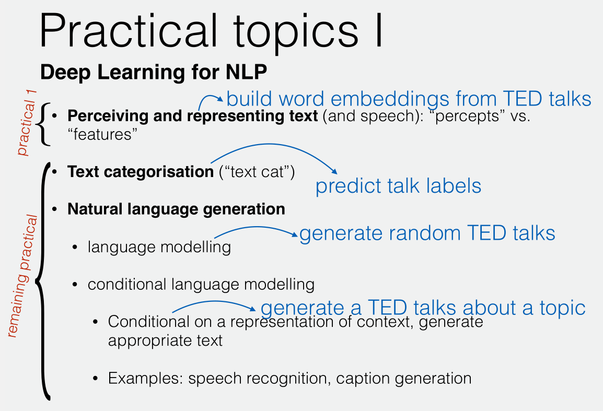
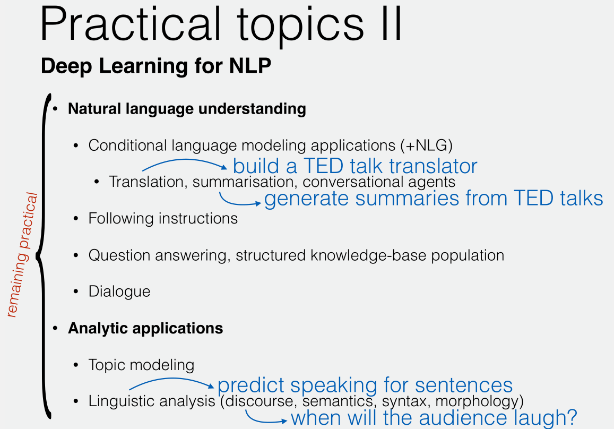

# Oxford Deep NLP学习笔记2：Overview of the Practicals

本节课是Oxford Deep NLP 2017 course的第二课，由Chris Dyer（Dynet作者之一）讲解关于本门课程的实践任务。

Slides：https://github.com/oxford-cs-deepnlp-2017/lectures

Videos：https://www.bilibili.com/video/av9817911/?from=search&seid=2691326368420649676

Prerequisite: Probability, Linear Algebra, and Continuous Mathematics, basic Machine Learning and Neural Networks. 

本人是自然语言处理小白一枚，由于没有中文翻译字幕，因此若有不当的翻译和理解，还望指正。

##Practical Topics I

Perceiving and representing text：指如何让计算机中感知并表示文本语料。

上一节中我们讨论的是最基本的如何表示一个词，但在实际应用中还有很多值得正视的问题，比如：

- 在应用模型于一笔新数据上时，如果遇到了在训练时没有见过的词，该怎么处理？
- 对于没有分隔符的语言的文本（比如中文），怎么分词才能没有歧义？
- 需要小写化吗？需要尝试检查拼写吗？
- 把文本看做字符流还是字节流？

以上的问题涉及到我们如何去做文本的预处理(preprocess)。

对于理解单元(perceptual unit)大小的权衡(trade off)：

- 较细的理解单元（个人理解是指理解到很细腻的语义），需要更加复杂的模型，但是遇到非规范用语（OOV，或者理解为训练时没有看到过的情况）时的处理能力更好；
- 较粗的理解单元对应的模型会简单一些，但是测试时遇到OOV会是个大问题。

[Heap's law](https://en.wikipedia.org/wiki/Heaps%27_law): 描述在一段文本中，不同词语的数目。推论是采集的语料库越大，都会有越多的新词汇进入语料中。

（上面感觉讲的有点快和乱）

终于引出了表示学习([Representation learning](https://en.wikipedia.org/wiki/Feature_learning))的概念，通过让文本预测其上下文来计算出自身的特征表示，对应了上节课讲的Skip-gram的方法。

##Practical Topics II

自然语言的任务有：

- 文本分类 (Text categorization)
- 自然语言生成 (Natural language generation)
  - 语言建模 (language modelling)：为语言中的句子赋予一个概率，描述这个句子有多大程度上是合理的。产生一段和训练文本概率分布相似的文本，比如打字时候的自动改正和字词联想；
  - 条件语言建模(conditional language modeling)：在给定上下文、已知信息的条件下对语言建模，并有一个合适的实际反馈，如更准确的自动改正、语音识别(speech recognition)，摘要生成(caption generation)等。比如你知道用户的双胞胎身份、年龄，那么在打字自动改正或联想时应当考虑到这些条件信息。
- 自然语言理解(Natural language understanding)
  - 加入了自然语言生成(NLG)的条件语言建模：具体应用有机器翻译(machine translation)，文本自动摘要(text summarization)，对话代理(conversational agents)
  - 响应人给出的现实指令
  - 问答系统(Question Answering)、对话系统(Dialogue system)
- 分析型应用(Analytic applications)
  - 主题建模(Topic modeling) ，即抽象出文本中潜在的主题
  - 语言学分析(Linguistic analysis)，可能涉及语篇(discourse)、语义(semantics)、语法(syntax)、morphology(形态学)

##Practical Details

### TED Dataset

在本门课的实践中，只涉及一个数据集(Dataset)，理由是它已经能满足大部分任务的要求，我们要学会转换这一份数据集来面对不同的任务，同时在现实中也要学会挖掘手头数据的价值。

该数据集来自于TED的演讲稿，这些演讲涉及大量的不同主题（但风格都相似），数据量也能与计算资源相匹配。另外，每次演讲都有一些人工整理的有用信息，比如主题标签、标题、总结等。数据集的具体详情见下图。

回顾：下面蓝字的部分是TED数据集如何对应上面提到过的这些任务。

###Software in Practicals

对于深度学习的定义有多种多样，讲师提出了Deep Learning的一个特点：过去的机器学习(or shallow learning)中人们总是花大量时间在特征工程(feature engineering on existing model)上，而不是对模型的改进，但当下的深度学习更关注于强化模型，而不是特征工程。

<u>深度学习的模式：设计模型、实现模型、测试、分析、重复，以达到快速迭代的目标。</u>其中实现模型、优化函数、加速计算是非常关键的。

然而由于计算微分(forward pass & backward pass)非常容易出错， 我们需要采用一些工具（Pytorch, Tensorflow, Theano, Dynet...）来简化模型的代码实现，这些多种多样的工具通常都包含常用的神经网络组件、自动微分功能等，因此可以大大减少工作量。

计算图的声明(computation graph declare)方式：

- **静态(static)**：如Tensorflow和Theano。首先为训练/测试实例中要进行的计算预先定义一些符号和过程（对于可变输入，要让定义的模型具有接收、处理可变输入的能力），然后工具会优化流图，再运行它优化后的代码。
  - 优点：优化和加速计算。
  - 缺点：Write a program that raises another program.实际上是将写好的符号程序(symbolic program)编译成第二种程序，而这第二种程序不一定能提供所有我们想要的灵活操作。
- **动态(dynamic)**：如Dynet和Pytorch。命令式地写下每一步所做的计算，这些工具所做的就是跟踪定义的操作，并隐式地生成符号表示（通过操作符重载）
  - 优点：可以直接用C++/Python写代码，而无需学习一种新的语言，因此更易入门(lower learning curve)
  - 缺点：对计算的优化有限。

>静态图需要在处理数据前定义好一套完整的模型；
>
>而动态图模型允许用户先定义好一套基本的框架再根据数据来实时修正模型。

