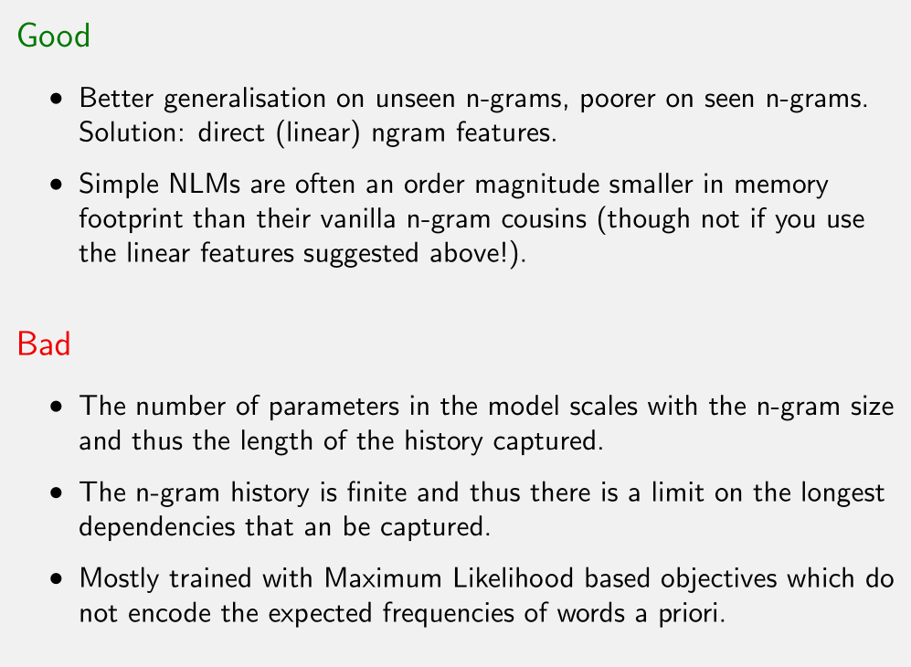

# Oxford Deep NLP学习笔记3：Language Modeling and RNNs Part-1

##3.0 前言

本节课是Oxford Deep NLP 2017 course的第三课，由Phil Blunsom讲解循环神经网络和自然语言建模。

Github: https://github.com/lecholin/Oxford-DeepNLP-2017

Slides：https://github.com/oxford-cs-deepnlp-2017/lectures

Videos：https://www.bilibili.com/video/av9817911/?from=search&seid=2691326368420649676

Prerequisite: Probability, Linear Algebra, and Continuous Mathematics, basic Machine Learning and Neural Networks. 

本人是自然语言处理小白一枚，由于没有中文翻译字幕，因此若有不当的翻译和理解，还望指正。

---

## 3.1 Language Model 

语言模型是贯穿整个自然语言处理任务的基础，它的定义是：为词序列赋予概率值，使得$\sum_{w \in \sum^*}p(w) = 1$。直观上来看，就是说给定一段观察到的文本（字符串），它符合自然语言的概率是多大。

例如，有了语言模型，我们在机器翻译中就能比较两个有不同词序的句子，如p(he likes apples) > p(apples likes he)，显然前者更可能是一个自然语言的句子。再如语音识别中判断同一个发音采取哪个词更合理，如p(he likes apples) > p(he licks apples).

通常我们提及语言模型时，都会把句法和语义融合在一起考虑。

大多数自然语言处理任务都可以结构化为条件语言模型(conditional language modelling)。

- 翻译(Translation)：给定两个不同语言的句子，判断它们互为翻译的概率，如$p_{LM}$(Les cheins aiment les os ||| Dogs love bones)
- 问答(Question Answering)：给出一个问句，另一句话是其答案的概率。如已知信息β，$p_{LM}$(What do dogs love? ||| bones. | β).
- 对话(Dialogue)：$p_{LM}$(How are you? ||| Fine thanks. And you? | β)。

实质就是在一定条件或已知信息下，两个字符串的联合分布(Joint Distribution)概率有多大。具体实现时，几乎所有语言模型都采用链式法则，将联合分布概率的计算分解成一系列的条件概率，每一部分都是通过之前观察到的词来学习出当前的词，即$\begin{align*}p(w_1, w_2, w_3, ...w_N) &= p(w_1)*p(w_2|w_1)*p(w_3|w_1,w_2)*...*p(w_N|w_1, w_2, ...w_{N-1})\end{align*}$

这样的统计语言模型是容易去实现的，因为我们无需人工标注，直接从网络上、语料库中爬取数量巨大的文本，用机器学习的手段去建模，就能得到想要的语言模型。但在实践中人们发现到，给定之前观察过的词，训练时以应该接在后面的词作为目标，这样的一种训练或者说学习，看似只是对手头数据的拟合，但确已经隐含了大量自然语言理解(NLU)的行为。因此，语言模型的建立过程中，得到了很多自然语言的理解信息。

举个栗子，如果要扩展出"There she built a"后接的词而没有任何已知信息，求p(·|There she built a)，那么会有很多很多种可能；但是如果有了上下文信息，就可以约束下一个词，比如p(·|Alice went to the beach. There she built a)，后面接"sand castle"/"boat"是概率更大，原因就是利用了上下文信息，模型“理解”了指代关系里，"she"对应"alice"，"There"对应"beach"。

###3.1.1 Evaluating a language model

假定已经有了大量的文本数据和一个隐含了逻辑推理的目标函数，那么我们就要考察什么样的模型是好的模型。粗略地说，一个好的模型会为真实的语料表达(utterance)赋予高的概率值。

衡量语言模型好坏的具体指标有：

- **Cross entropy（交叉熵）**。如果你学过文本压缩算法，就会知道**压缩编码和赋予概率值是等价的**。交叉熵衡量的就是用我们的模型需要多少位(bit)来编码同一段文本。数学公式为$H(w_1^N) = - \frac{1}{N}*log_2 p(w_1^N)$.
- **Perplexity（困惑度）**，衡量的是语言模型面对下一个词时的困惑程度，如果模型始终准确知道下一个词是什么，那么困惑度就是1。数学公式为perplexity($w_1^N$) = $2^{H(w_1^N)}$，即交叉熵的幂次方。【推荐阅读：[Perplexity详解](http://blog.csdn.net/luo123n/article/details/48902815)】

通常在预测词的任务上以perplexity作为指标；在字符级别上以cross entropy为指标(bits per character)。

### 3.1.2 Language Modelling Data

建立语言模型，就是在解决时间序列的预测问题，所以在划分数据集时，要保证train on the past and test on the future，也就是测试集里的数据和训练集里的数据不要在时间上重叠。

同时，如果语料库(corpus)是由大量文章组成的，那么为了提高语言模型的质量，最好保证测试数据和训练数据来自两个不相交的集合（也许可以理解为主题不同？）。

提一句，数据量最好非常大，保证采用的词汇表(vocabulary)也足够大。

语言模型衡量方面的两个流行的数据集是Penn Treebank和The Billion Word Corpus，但两者都有缺陷：前者数据量太小且高度预处理过，不足以代表现实中的自然语言；后者采样了大量句子，但训练和测试的句子可能来自同一篇文章，并带有时间重叠。相比之下，最近的WikiText datasets是一个更好的选择。

---

##3.2 Model Details

接下来将围绕采用什么模型进行讨论，主要涉及三种方法来参数化语言模型：

- 基于计数的n-gram模型：每次只考虑当前词的前n个词。
- 神经化的n-gram模型：将固定的n-gram历史嵌入到连续空间，来更好地捕捉历史之间的关联。
- 循环神经网络(Recurrent Neural Network)：抛弃n-gram，而将整个历史信息都压缩成一个固定长度的向量，来捕捉更大范围的历史信息。

###3.2.1 Count bases N-Gram Language Models

####3.2.1.1 Markov Assumption

尽管我们已经将词的联合分布分解成了条件概率的乘积，但越往后，需要考虑的条件就越多，比如一个长度为20的句子，对于最后一个单词要以前19个单词作为条件，这样的计算量和复杂程度都是很大的。

N元模型基于马尔科夫链假设(The Markov Chain Assumption)，大致观点是只有部分之前的信息才对当前有影响。

解释一下马尔科夫假设(Markov Assumption)：

- 只有以前的历史才决定当前的状态
- 由于内存有限，只考虑前k-1个单词，越往前的单词相关程度越小。
- k阶马尔科夫模型(kth order Markov model)

> 一元模型(uni-gram)，二元模型(bi-gram), 三元模型(tri-gram)

例如常见的2-元模型，假设每个词只和它前面的一个词有关，而不是像上面说的去往前考虑19个单词。用数学公式表述即

$\begin{align*}p(w_1, w_2, w_3, ...w_N) &= p(w_1)*p(w_2|w_1)*p(w_3|w_1,w_2)*...*p(w_N|w_1, w_2, ...w_{N-1}) \\& \approx p(w_1)*p(w_2|w_1)*p(w_3|w_2)*...*p(w_n|w_{n-1})\end{align*}$

虽然这样做会丢失大量上文信息，但会极大方便我们计算、估计概率分布。N元模型的N是由我们定义的，因此可以采用三元或更多元来获得更准确的分布。

对于每个概率值，以3-gram为例，一种简单的估计方法就是极大似然估计(maximum likelihood estimation)，即$p(w_3|w_1, w_2) = \dfrac{count(w_1, w_2,w_3)}{count(w_1, w_2)}$，训练其实就是统计出现次数的过程。这种训练方法非常简单，而且在实践中可以结合一些计算架构如Map Reduce(Hadoop)来加速计算。

####3.2.1.2 Back-off smoothing

> 推荐阅读：[自然语言处理中N-Gram模型的Smoothing算法](http://blog.csdn.net/baimafujinji/article/details/51297802)

事实上，这种似然估计并不是一种好的估计方案。比如我们要计算Oxford Pimm's eater和Oxford Pimm's drinker这两句话的概率值(Pimm's 是一种鸡尾酒)，但很有可能这种三元词并没有在训练的语料里出现过，那么就会导致这两句话的概率值都是0而无法区分它们。

一个更好方法是回退到二元估计(interpolate with the bigram)，如果用前两个词无法较为确切地估计下一个词，那就用前一个词来估计下一个词。比如在这个例子里，把Oxford去掉后比较Pimm's eater和Pimm's drinker，那么后者可以在语料库里找到，就会赋予一定的概率值而不是0.

>在高阶模型可靠时，尽可能的使用高阶模型。但是有时候高级模型的计数结果可能为0，这时我们就转而使用低阶模型来避免稀疏数据的问题。

#### 3.2.1.3 Interpolated Back-Off

递归地用(n-1)gram概率来插入到n-gram概率中，我们可以使语言模型更加平滑，保证在给定上下文时所有词的概率都非零。其中一种最简单的方法就是线性插值(linear interpolation)，用数学公式表达就是

$p(w_n|w_{n-2}, w_{n-1}) = \lambda_3p(w_n|w_{n-2}, w_{n-1})+\lambda_2p(w_n|w_{n-1})+\lambda_1p(w_n)$，其中$\lambda_3+\lambda_2+\lambda_1 = 1$.

除了上面的λ常量线性插值法，也有让参数λ值随着历史而变化的插值法Jelinek-Mercer Smoothing，还有Absolute Discounting（对出现次数较多的计数，减出一个较小的值分给没有出现的情况）等等....

由于之前提到过的Heap's Law的存在，上述问题会持续出现，依然还有研究的必要性，这也是为什么传统基于规则的AI不适用于NLP的原因之一（不管人工定义多少规则，始终会有看不到的规则和语法结构）。

基于计数的n-gram的优点主要是统计的方法比较简单（如果建好索引就只是常量时间的查表而已），而且有复杂的平滑算法辅助，缺点主要是不能捕捉完整的历史信息（比如上面Alice去沙滩的例子），有时候不能捕捉语义相似词的概率分布。更多的优缺点在下面这张图中解释的详细一点。

### 3.2.2 Neural N-Gram Language Models

在N-gram的基础上，不使用统计的方法产生概率，而是用神经网络产生概率值，同时尽可能捕捉N-gram内的关联。

#### 3.2.2.1 Basic Neural Language Model

以三元模型为例，构建只有单个隐藏层的神经网络，其中$w_i, \hat p_n$的长度都是词汇表大小V（通常都大于1e5），前者是one-hot向量，后者稠密向量且每一维的值是对应单词作为$w_n$的概率。

输入的两个单词通过隐藏层h的函数g，再在输出层线性变换后执行softmax，将概率值分布到所有词上。

#### 3.2.2.2 Sampling (?)

让语言模型生成(generate)一个句子作为反馈，而不是给出一个已知句子的概率打分。

每次给网络模型两个输入，从得到的softmax分布中随机抽样出一个单词，再将这个单词作为下一次的输入，我们就能生成句子。这也是在语音识别和机器翻译中所做的事情，因为在这些任务中，也不是给定一个句子，而是需要生成一个句子。

如下图所示，先以两个开始符号\<s>作为输入，然后取样出第一个词"There"，和第二个开始符号一起作为下一个输入，取样出第二个词"he"，不断重复，就能从语言模型中得到一个句子。

#### 3.2.2.3 Training

> ​	参考阅读：[哈？你还认为似然函数跟交叉熵是一个意思呀？ - 知乎专栏](https://zhuanlan.zhihu.com/p/27719875)

如下图所示，每次都用前馈神经网络产生的概率分布$\hat p_n$(predict)和one-hot向量$w_n$产生代价，采用交叉熵（实际上是极大似然估计MLE），定义目标函数为$F = - \frac {1}{N} \underset{n}{\operatorname{\sum}}cost_n(w_n, \hat p_n)$，同时$cost(a, b) = a^Tlog(b)$.

训练时，采用反向传播(Back-propagation)来更新模型中的参数W（输出层参数）和V（隐藏层参数），上图的红色箭头表示了运用链式法则(chain rule)求偏导并更新的方向，公式如下：

在下图展开的神经网络中(unrolled network)中，n指第n个time step，我们看到在下图中每次都会用到4个代价$cost_1, cost_2, cost_3, cost_4$来计算$F$，然后再进行反向传播。注意，看似下面有4个网络的实例，但实际上这些实例的W和V是同一个。每一个time step即图中的每一列，计算梯度都是独立的（因此可以分配到不同的CPU和GPU进行），最终通过汇总这些更新(parallel and sum)，来对参数W和V更新。

#### 3.2.2.4 Comparison with Count Based N-Gram LMs

优点：

- 对于训练中没有看过的n-gram组，神经网络模型的效果会比计数模型的效果好。比如训练数据里有"the blue cat"/"the red cat"/"the green cat"，那么神经网络就会捕捉到"the xxx cat"(xxx代表颜色)的组合关联，当遇到未见过的句子"the brown cat"时，由于brown和blue/red/green的语义相似度高（前提是加入word embedding layer），因此该句子也会被赋予非常高的概率，而计数模型就无法发掘这种关联。
- 简单的神经网络模型所占用的内存和计数模型在同一个数量级，不会增加过多的内存消耗。

缺点：

- 由于依然使用了N-gram模型，因此只能利用局部历史信息，而不能捕捉长距离的依赖关系(long-range dependencies)，相对于计数模型，神经网络利用非线性变换(non-linearity)捕捉这n元组之内的关联，比如New York这两个词的强共现关系，但这可能会影响测试集上的泛化。（可以算有利有弊吧？）
- 参数量会随着n值的增加（即历史信息长度的增加）而增加。
- 极大似然估计作为目标不够好，因为它没有考虑先验分布(prior distribution)，因此依然需要进一步研究，比如考虑更适合语言的贝叶斯(Bayesian)等。

### 3.2.3 Recurrent Neural Network Language Models

> [Recurrent Neural Networks Tutorial, Part 1 – Introduction to RNNs ](http://www.wildml.com/2015/09/recurrent-neural-networks-tutorial-part-1-introduction-to-rnns/)

传统的前馈神经网络（下图左）只能利用有限的历史信息，但是我们希望能考虑到无限的历史信息而不遗漏，也就是在隐藏层总结之前所有的信息，因此引入循环神经网络(recurrent neural network, RNN,下图右)，不同的地方在于，隐藏层的输出既依赖于当前时间点的输入$x_n$，还依赖于上一时间点的隐藏层输出$h_{n-1}$。

具体地说，首先将开始符号\<s>作为t=1时的输入，在输出层的概率分布中抽样出第一个词"There"，作为t=2时的输入，同时t=1时隐藏层的输出作为t=2时隐藏层的输入。<u>这种隐藏层之间的直接连接，是和上一节的神经网络结构的不同之处</u>，在上一节中，t=2时的梯度流不会蔓延到t=1中，因为它们彼此是独立的。更重要的是，**RNN中每个时间点只输入一个单词，而不是n-gram里的n-1个单词，把过往的所有信息都存在隐藏层的参数里，突破了n-gram的局限。**

那么现在面临的问题就是，普通神经网络的梯度下降是笔直的(straight-forward），对这样的循环结构，如何做梯度下降呢？

####3.2.3.1 BPTT

我们可以将网络结构展开(unroll)后去分析，展开后的网络就是一个有向无环计算图，因此依然可以视作在DNN上做梯度下降，但是此时的每一列已经不是独立的了，所以不能分布在不同的CPU或GPU上计算。（之前的n-gram神经网络我们可以精神上看做是四个神经网络，但这里我们只能看成是一个整体！）

例：t=2时目标函数F对h2的参数更新，注意观察下图红色字体的元素——时间点2之后的所有时间点都会将梯度流(gradient flow)传回至h2，并影响h2的参数更新。因此在求F对h2的偏导数时，要把红色字体部分的梯度流都纳入计算，也就是加入了下图等号右侧的后两部分。

RNN中更新参数的算法，称之为**BPTT**(Back Propagation Through Time)，是BP算法的扩展，顾名思义就是梯度流随着时间往前更新。

BPTT的缺点：通常会以句子为单位进行RNN+BPTT，但随着句子长度的增加，time steps也会线性地增长，梯度的计算量会大幅增加，这是一个大问题。 

####3.2.3.2 TBPTT

如果我们在固定长度的time steps（称为一个Segment）之间，保留前向传播，而<u>将隐藏层之间的反向梯度更新截断</u>，就得到了**TBPTT**(Truncated Back Propagation Through Time)。通常会取在10/20/50步之间截断梯度的回传。

例：如下图所示，每两个time steps 之间有一条红色的虚线隔开，表示前向传播不受影响，但反向传播时t=2以后梯度不会流到h2处，h2不再受h3和h4的梯度影响。

尽管不跨Segment进行反向传播会丢失一些历史信息，但是单个Segment内的信息还是能被有效利用的。由于保留了Segment间的前向传播，所以训练得当的话依然能够泛化到测试集中。（实际上是为了加速计算，而取的一种近似）

TBPTT这样子做的好处就是，可以通过将文本分割成等长的Segment来并行计算。比如我们有10亿个单词组成的语料和10个CPU，那么我们就可以将该语料分割成10个Segment，然后让每一个CPU并行地处理1个Segment。

#### 3.2.3.3 Mini-batching and Complexity

由于GPU可以快速地进行矩阵间的乘法(matrix matrix multiplication)，而且两个矩阵之间相乘会比等量的向量矩阵(vector matrix multiplication)相乘更快，所以在深度学习中，经常采用Mini-batch，将后者转换成前者。对于RNN而言，就是尽可能为recurrent matrix V和softmax matrix W加入Mini-batch。

以上面的10个Segment为例，加入Mini-batch后，每个Segment的第一个time step可以不单独进行，而是将输入的向量组成矩阵，和输入层-隐藏层之间的变换矩阵V一起传入GPU，计算起来会更快。

由于截断的长度都相同，TBPTT能很好地支持Mini-batch，但BPTT以句子为单位分割，句子长度不一会导致GPU计算的效率低下。

#### 3.2.3.4 Comparison with N-Gram LMs

优点：

- RNN能捕捉更多的历史信息(long range dependencies)，对于机器翻译（词义不对齐）这类不适合用N-gram解决的任务有很大的提升。
- RNN还能压缩历史到固定长度的隐层中，对于一些不需要每个step都输出的任务，比如文档分类而言，RNN采取的这种压缩表示是非常有用的。
- RNN参数的数量不会随着要捕捉的历史的长度而增加（但如果想捕捉更多的信息量，就要增加参数数量）。

缺点：

- RNN很难训练，这是自上世纪90年代以来一直存在的问题。训练得不好就不能保证捕捉了long range dependencies.
- 随着隐层参数的增加，计算所需的内存量会呈平方级增加
- 同上一节中的网络一样，极大似然估计不适合真正做目标函数。

### 3.2.4 Bias vs Variance in LM Approximations

> 推荐阅读：[机器学习中的Bias(偏差)，Error(误差)，和Variance(方差)有什么区别和联系](https://www.zhihu.com/question/27068705)
>
> low-bias：模型复杂化，参数更多，容易导致过拟合；low-variance：简化模型，减少参数，容易导致欠拟合。

N-gram模型是有偏差的，但是方差很小；RNN减少了N-gram的这种偏差，但是会增加一点方差。

在下一节课里会讨论解决RNN的训练问题的架构和算法方案...